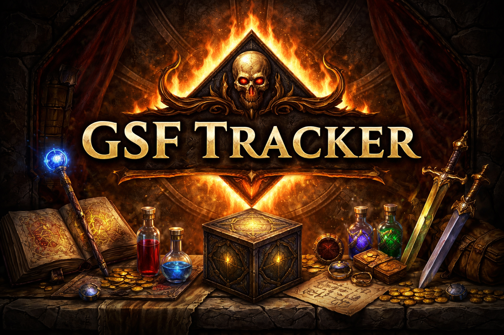

## Build the project initially

Navigate to the frontend directory and run the following:

1. `npm install`

2. `npm run build`

Navigate to the backend directory and run the following:

1. `npm install`

2. `npm run build`

## Run the app for active development

Navigate to the frontend directory in a new terminal and run the following:
`npm run dev`

Navigate to the backend directory in a new terminal and run the following:
`npm run dev`

## Deploy to GCP using Docker

1. Build the docker image and tag with appropriate release version
   `docker build -t gsf-tracker:v1.0.0 .`

2. Tag the image using the GCP Artifactory link
   `docker tag gsf-tracker:v1.0.0 gcr.io/gsf-tracker/gsf-tracker:v1.0.0`

3. Push the image to the GCP Artifactory
   `docker push gcr.io/gsf-tracker/gsf-tracker:v1.0.0`
